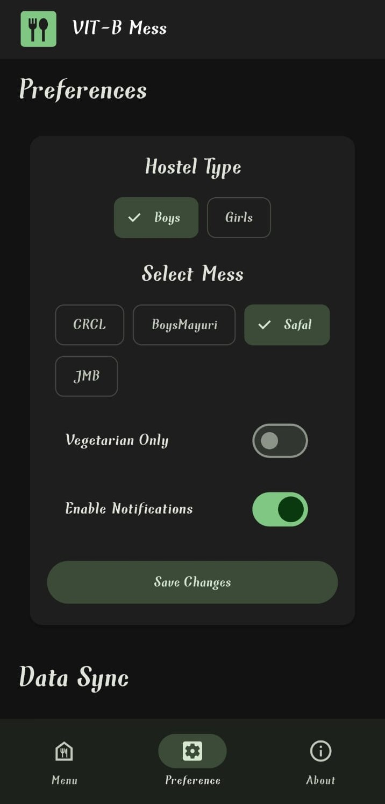
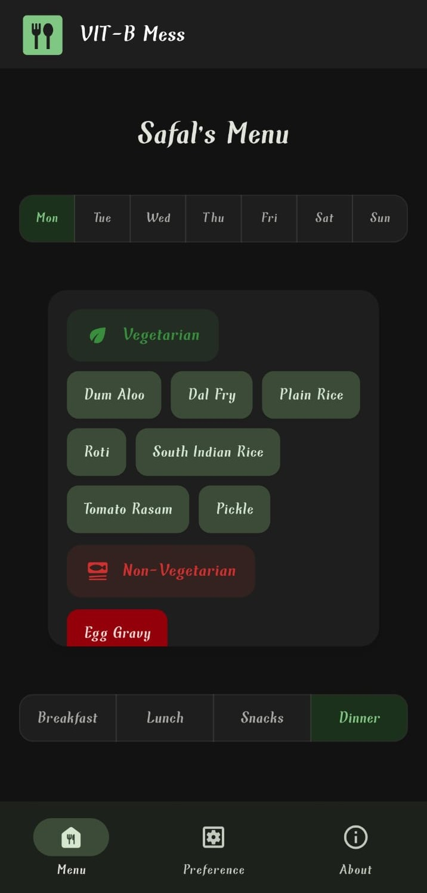
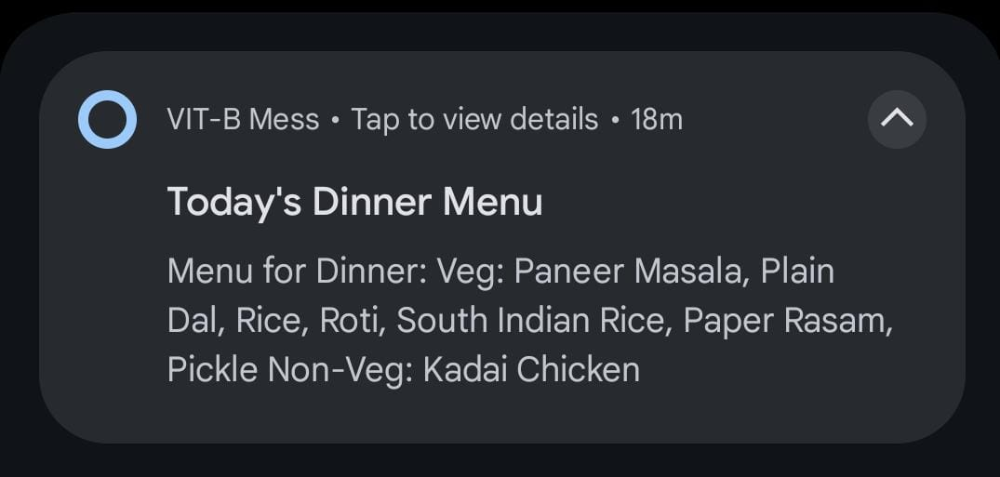

# 🍱 VITBMess App - Your Daily Meal Companion! 

VITBMess is a full-stack mobile application developed to enhance the campus dining experience at **VIT Bhopal University**, serving over **10,000+ students** daily. It offers real-time meal updates, customizable notifications, offline support, and a beautifully responsive UI.🌟

<div align="center">
  
  
  
  
</div>

---

## 📱 Features

- 📅 **Daily Mess Menu Updates** – View real-time meal plans from all hostel messes  
- 🔔 **Automated Notifications** – Get notified 30 minutes before breakfast, lunch, and dinner  
- 🥦 **Veg / Non-Veg Filters** – Customize your meal view based on dietary preferences  
- 📶 **Offline Mode** – Works seamlessly without internet thanks to local Hive database  
- ⚡ **Timezone Handling** – Notifications are scheduled accurately across timezones  
- 💎 **Material Design UI** – Clean, intuitive, and responsive interface for VITB students

---
## 🔔 Notification Scheduling
The app schedules notifications 30 minutes before:
| 🍽️ Meal  | 🕒 Starts At | 🔔 Notification At |
| --------- | ------------ | ------------------ |
| Breakfast | 7:30 AM      | 7:00 AM            |
| Lunch     | 12:30 PM     | 12:00 PM           |
| Snacks    | 5:00 PM      | 4:30 PM            |
| Dinner    | 7:30 PM      | 7:00 PM            |

---

## 🖼️ Screenshots

| 📋 Home | 🍽️ Meal Details | 🔔 Notification |
|--------|-----------------|-----------------|
|  |  |  |
---

## 🔧 Tech Stack

| 🛠️ Technology | 💬 Description |
|--------------|----------------|
| **Flutter** | Beautiful cross-platform UI |
| **Dart** | Lightning-fast, expressive language |
| **Hive** | Lightweight, NoSQL local DB |
| **AWS Lambda** | Serverless backend for fetching meal data |

---
## 🍚 Mess Data
Mess Data of the all the messes of the Boys and Girls Hostel of VIT Bhopal
- CRCL
- AB Catering
- JMB
- Mayuri
- Foodex by Safal

---

## 🏁 Getting Started

### 1️⃣ Requirements

- Flutter SDK (v3.x recommended)
- Android/iOS device or emulator
- AWS Lambda endpoint with meal data

### 2️⃣ Setup

```bash
git clone https://github.com/Gurkirat2915X/VIT-B-Mess-App.git
flutter pub get
flutter run
